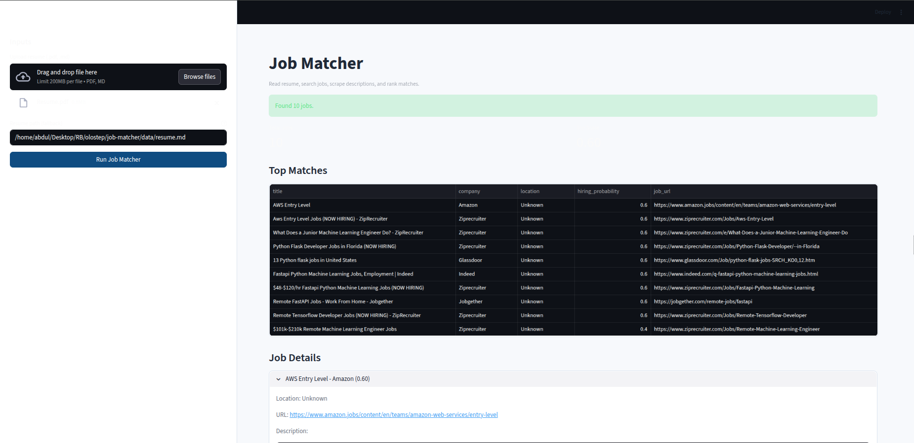
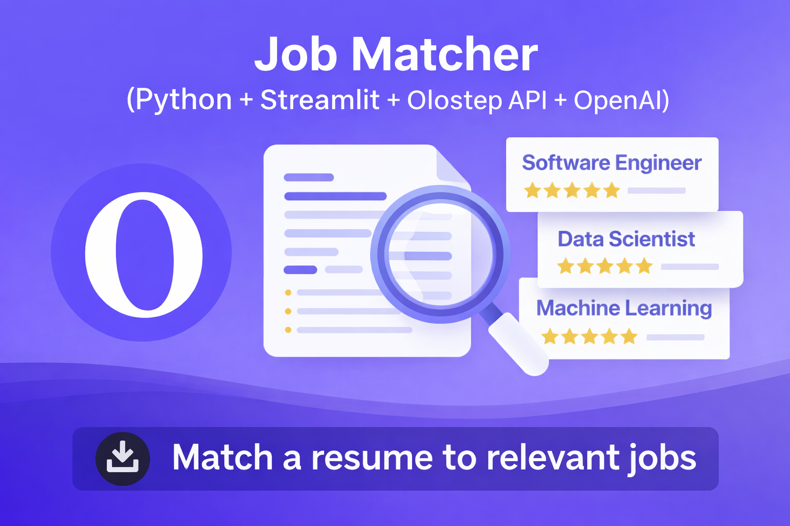

# Job Matcher (Python + Streamlit + Olostep API + OpenAI)

Match a candidate resume to relevant jobs using a lightweight Python workflow: parse resume content, search jobs via the [Olostep API](https://www.olostep.com/), scrape missing job descriptions, score interview likelihood, and store ranked results in JSON.



## Why This Project

This project helps you:
- Upload a `.md` or `.pdf` resume and run matching from a UI.
- Search for relevant roles using resume-derived queries.
- Scrape job pages when search results do not include full descriptions.
- Rank jobs by estimated interview probability.
- Persist deduplicated job results locally.

## Features

- Streamlit dashboard (`app.py`)
  - Upload resume file (`.md` or `.pdf`) or provide local resume path.
  - Run matching workflow manually.
  - Inspect ranked jobs and full descriptions.
  - Download result JSON.
- CLI one-shot runner (`run_matcher.py`)
- Agents-based workflow orchestration (`src/job_matcher/agent.py`)
- JSON persistence with dedupe (`data/jobs.json`)

## Prerequisites

- Python 3.10+
- `pip`
- Valid `OLOSTEP_API_KEY`
- Valid `OPENAI_API_KEY`
- Internet access for API requests

## Quick Start

### 1) Install dependencies

```bash
pip install openai openai-agents requests pydantic python-dotenv streamlit pypdf
```

### 2) Configure environment

Copy `.env.example` to `.env` and set keys:

```env
OLOSTEP_API_KEY=your_olostep_api_key_here
OPENAI_API_KEY=your_openai_api_key_here
```

### 3) Add resume

Default local path used by CLI/UI (when no upload is provided):

```text
data/resume.md
```

This default is configured in:

```text
settings.py
```

You can also use a PDF resume (`.pdf`).

## Run the App

### Streamlit dashboard

```bash
streamlit run app.py
```

### CLI one-time run

```bash
python run_matcher.py
```

Optional flags:

```bash
python run_matcher.py \
  --resume data/resume.md \
  --jobs data/jobs.json
```

## Output Files

All runtime data is written under `data/`.

| File | Purpose |
|---|---|
| `data/jobs.json` | Deduplicated ranked job matches including description and score |
| `data/uploads/*` | Uploaded resumes from Streamlit UI |

## Project Structure

```text
.
├── app.py                         # Streamlit dashboard entrypoint
├── run_matcher.py                 # CLI one-time runner
├── assets/
│   ├── UI.png                     # Streamlit dashboard screenshot
│   └── Thumbnail.png              # Olostep parser/search preview image
├── settings.py                    # App-level configuration (default resume path)
├── data/
│   ├── jobs.json                  # Stored ranked jobs
│   └── uploads/                   # Uploaded resumes
├── models/
│   ├── job.py                     # Job schema
│   └── resume.py                  # Resume schema
├── tools/
│   ├── job_parser.py              # Resume parsing (includes PDF via OpenAI)
│   ├── job_search.py              # Search + recursive scrape helpers
│   └── scoring.py                 # Interview probability scoring
├── src/
│   └── job_matcher/
│       ├── agent.py               # Workflow orchestration and agent tools
│       ├── constants.py           # Shared paths/defaults
│       └── service.py             # Service wrapper around workflow
└── utils/
    ├── date_utils.py              # Recency helper utilities
    └── pdf_to_markdown.py         # Fallback PDF text extraction
```

## Notes

- Resume parsing supports `.md` and `.pdf`.
- The search step uses Olostep `searches`; scraping fallback uses Olostep `scrapes` for missing descriptions.
- Jobs are deduplicated by title, company, and URL.

## API Resources and Documentation

Use these official links for setup, API access, and endpoint references:

- Olostep homepage (web scraping and search API platform): https://www.olostep.com
- Olostep API keys dashboard (create/manage your key): https://www.olostep.com/dashboard/api-keys
- Olostep Scrapes API docs (page scraping endpoint): https://docs.olostep.com/features/scrapes/scrapes
- Olostep Searches API docs (search endpoint): https://docs.olostep.com/searches/searches
- OpenAI API keys page (create/manage `OPENAI_API_KEY`): https://platform.openai.com/api-keys

These resources cover the full integration path for this project: generate API keys, run resume parsing with OpenAI, execute job discovery with Olostep Searches, and enrich missing job descriptions with Olostep Scrapes.


